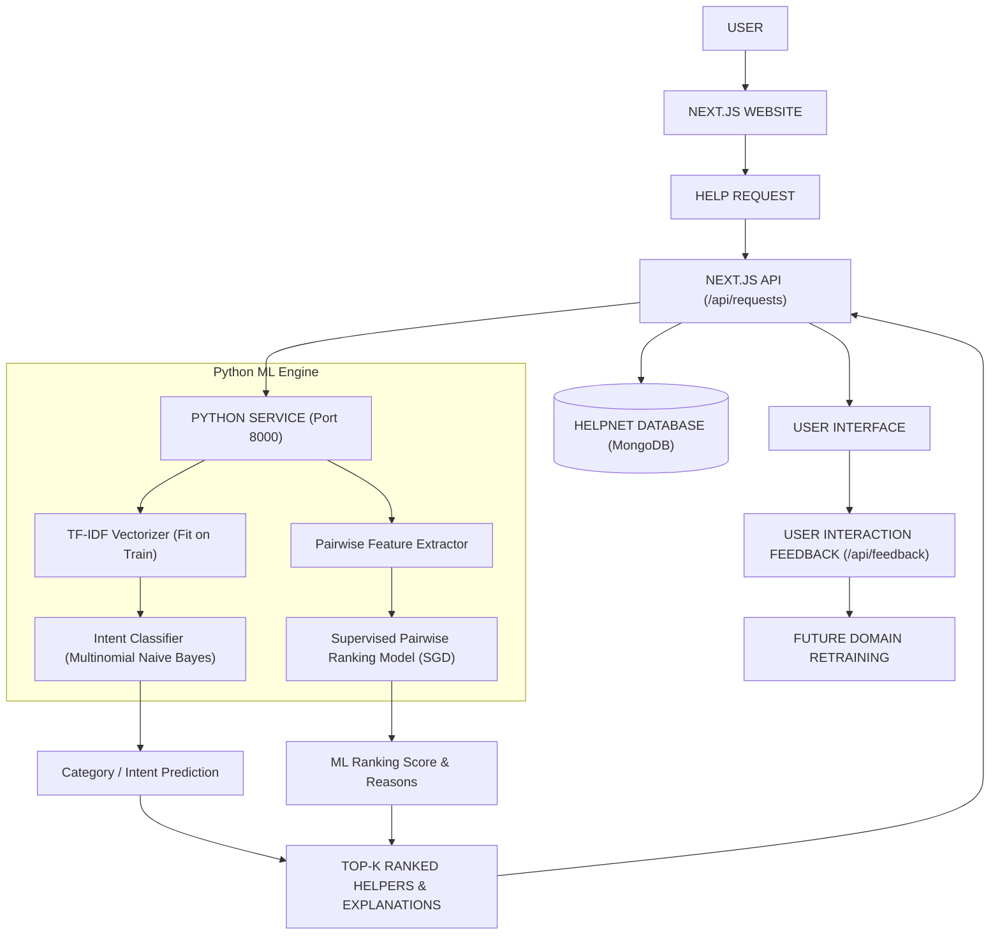

# HelpNet AI — System & ML Architecture

## Overview
HelpNet AI is an intelligent community assistance platform that connects people needing help with skilled neighbors. It features a complete, reproducible Machine Learning pipeline and Python microservice decoupled from standard Next.js application logic.

---

## 1. System Architecture Diagram

---

## 2. Separation of Traditional ML vs Generative AI

- **Traditional Machine Learning (Pure Python Engine)**:
  - Text tokenization, TF-IDF vectorization, multiclass intent classification (`Multinomial Naive Bayes`, `Softmax Centroid`).
  - Pairwise request-helper feature extraction: `[skill_overlap, tfidf_similarity, location_match, helper_rating]`.
  - Supervised Pairwise Logistic Regression ranking and probabilities trained via Stochastic Gradient Descent.
  - Feature-derived deterministic reason generation.
- **Generative AI (Gemini 1.5 Flash)**:
  - Cross-language text translation.
  - AI Request description enhancer & clarity scoring.
  - Trust & Safety policy moderation.

---

## 3. Microservice Endpoints (`ml_service/server.py`)
- `GET /health` : Service health status and model load state.
- `GET /model/info` : Model version, training parameters, and metrics registry.
- `GET /metrics` : Evaluation metrics for classification and matching models.
- `POST /predict/category` : Input request text -> returns predicted category and confidence.
- `POST /match` : Input request + list of candidates -> returns ranked candidates with probabilities and reasons.
- `POST /feedback` : Collects interaction outcomes for dataset expansion and future retraining.
